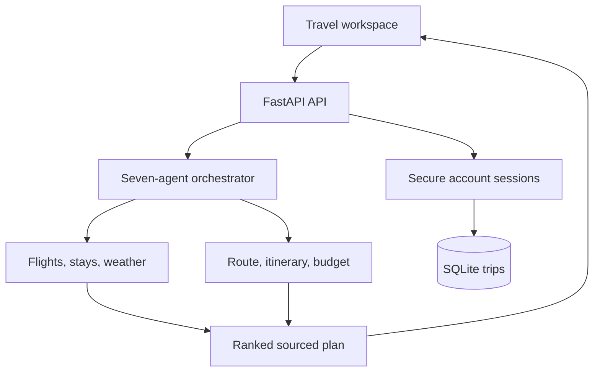

<div align="center">

# VoyageOS AI

### Multi-agent, end-to-end vacation planning & your travel copilot

**FastAPI · Groq · Python 3.11+ · Responsive frontend · Render**

One travel idea becomes ranked flight, rail, stay and cab options, a day-by-day itinerary, a transparent budget and a saved journey.


</div>

## Start with one sentence

> Plan a 6-day Bali trip for 2 people from Kolkata in December. Budget ₹1.4 lakh. We like beaches, nightlife, adventure and good hotels. Don't make the schedule exhausting.

VoyageOS launches seven focused agents for intent, route, stays, mobility, itinerary, budget and final critique. They compare travel modes, group sights by area, protect downtime, rank options and expose every estimate. Edit the details to regenerate, save the trip to an account, export JSON or print a clean PDF, and ask the copilot for advice.

**The frontend and FastAPI backend run together on one Render web service.** SQLite account storage is included, so there is no separate frontend deployment or database setup for local use and portfolio demos.

## What is included

| Capability | How it works |
| --- | --- |
| Seven-agent planner | Intent, Route, Stay, Mobility, Itinerary, Budget and Critic specialists produce one ranked result |
| Natural-language trip brief | Groq extraction when configured; a built-in parser otherwise |
| Global destination input | Eight built-in destination catalogs; Groq suggests sights elsewhere; a clearly marked flexible outline if neither is available |
| Flexible dates and groups | 1–30 days, 1–20 travelers, total budget in INR |
| Pace control | Relaxed, balanced or packed; at most 2, 3 or 4 suggested sights on full days |
| Thoughtful schedule | Area grouping, lighter arrival/departure days, lunch/rest blocks and optional stops |
| Transparent budget | Airfare, rooms, food, transport, experiences and 15% contingency |
| Honest feasibility | Over-budget plans stay over budget; the UI shows the gap |
| Stays | Value-ranked neighbourhood searches; real property discovery and photos with Google Places |
| Flights | Best-fit, lowest-price and fewer-stops choices; optional Amadeus offer lookup for mapped airports |
| Trains and road | Domestic rail suitability, official IRCTC handoff and route comparison without invented availability |
| Cabs and transfers | Airport pickup, ride-hailing and day-cab options with explicit cost allowances and provider handoffs |
| Weather | Open-Meteo forecast only for dates inside the next 16 days |
| Map | OpenStreetMap destination overview and Google Maps search links for sights |
| Copilot | Groq conversational travel advice with recent chat context; focused built-in responses without a key |
| Accounts and saves | Scrypt password hashes, signed HTTP-only sessions, user-owned SQLite trips, JSON export and printable PDF |
| Reliability | Timeouts, bounded requests, Pydantic validation, per-process rate limits, concurrency limits and optional-provider fallbacks |
| Design | Black canvas, electric blue accents, acid-yellow controls, travel photography and responsive layouts |

Built-in destinations: **Bali, Goa, Tokyo, Paris, Dubai, Bangkok, Manali and Singapore**.

## Quick start: Windows / VS Code

Extract the ZIP, open the **VoyageOS-AI** folder in VS Code, and use its terminal. Run commands from the folder containing `requirements.txt`.

```powershell
py -3.11 -m venv .venv
.venv\Scripts\python.exe -m pip install -r requirements.txt
Copy-Item .env.example .env
.venv\Scripts\python.exe -m uvicorn backend.main:app --reload --port 8000
```

Python 3.12 also works. If `py -3.11` is unavailable, use your installed Python 3.11+ interpreter.

Open **http://localhost:8000** for the app and **http://localhost:8000/docs** for the API. You do not need to activate the virtual environment or change PowerShell execution policy when using the commands above.

For full AI planning, edit `.env`:

```dotenv
GROQ_API_KEY=your_real_groq_key
GROQ_MODEL=llama-3.3-70b-versatile
AUTH_SECRET=replace-with-a-long-random-secret
```

Restart the app after changing environment values. **Never commit `.env` or put keys in frontend JavaScript.**

### macOS / Linux

```bash
python3 -m venv .venv
.venv/bin/python -m pip install -r requirements.txt
cp .env.example .env
.venv/bin/python -m uvicorn backend.main:app --reload --port 8000
```

## Deploy both frontend and backend on Render

1. Create a GitHub repository named `VoyageOS-AI` and upload the extracted project contents. `backend`, `dist`, `requirements.txt` and `render.yaml` must be at the repository root.
2. In [Render](https://dashboard.render.com/), choose **New → Blueprint**, connect that repository and select its branch. Render reads `render.yaml`.
3. Review the proposed `voyageos-ai` service and deploy it.
4. In the service's **Environment** page, add `GROQ_API_KEY`. Keep the model default or set a supported model in `GROQ_MODEL`.
5. Save and redeploy. Open the URL Render assigns to your service.

The same URL serves the complete frontend and `/api/*` routes. **Do not create a Static Site for this deployment.** The Python web service serves `dist/` itself.

`render.yaml` generates the session secret automatically. Its default SQLite file is suitable for local work and a demo. For durable production accounts across deploys, attach a persistent Render disk, mount it at `/var/data`, and set `DATA_DIR=/var/data`.

If creating a **Web Service** manually:

| Render setting | Value |
| --- | --- |
| Runtime | Python 3 |
| Root directory | Leave blank |
| Build command | `pip install -r requirements.txt` |
| Start command | `uvicorn backend.main:app --host 0.0.0.0 --port $PORT` |
| Health check | `/health` |
| Python version | `PYTHON_VERSION=3.11.11` |
| Instance | Free for a demonstration, or a plan you choose |
| Region | Singapore, or your preferred available region |

Render's free web services sleep after inactivity and have usage restrictions. The first request after sleep can take longer. Review [Render's free-service documentation](https://render.com/docs/free) before relying on it for a scheduled demonstration. Deployment configuration follows [Render's FastAPI guide](https://render.com/docs/deploy-fastapi) and [Blueprint reference](https://render.com/docs/blueprint-spec).

### Push updates from VS Code

After the first connection to your own repository:

```bash
git add .
git commit -m "Improve VoyageOS planning"
git push
```

The included Blueprint enables deployment on new commits. Do not upload `.venv`, `.env` or generated ZIP files.

## Optional travel providers

Everything can start without keys. Add providers one at a time:

| Variable | Purpose | Required? |
| --- | --- | --- |
| `GROQ_API_KEY` | Flexible natural-language extraction, suggestions for new destinations, open-ended copilot | For AI features |
| `GROQ_MODEL` | Default: `llama-3.3-70b-versatile` | No |
| `GOOGLE_PLACES_API_KEY` | Real hotel discovery, ratings, photos and author credits | No |
| `AMADEUS_CLIENT_ID` | Flight Offers Search client ID | No |
| `AMADEUS_CLIENT_SECRET` | Flight Offers Search secret | No |
| `AMADEUS_ENV` | `test` by default; `production` uses the production endpoint | No |
| `ENABLE_PUBLIC_ENRICHMENT` | `true` for Wikipedia/Open-Meteo; `false` for no public enrichment | No |
| `RATE_LIMIT_PER_MINUTE` | Per-IP POST limit, default `12` | No |
| `ALLOWED_ORIGINS` | Comma-separated origins only if using a separate frontend | No |
| `AUTH_SECRET` | Signs account sessions; generated automatically by the Blueprint | Production only |
| `DATA_DIR` | Directory containing the SQLite account/trip database | No |
| `COOKIE_SECURE` | `true` on HTTPS deployments; `false` for local HTTP | No |

### Groq

Create your key in [Groq Console](https://console.groq.com/). The server calls the [OpenAI-compatible chat endpoint](https://console.groq.com/docs/api-reference), requests JSON for extraction/discovery, and validates the returned data. Model support can change; select a current JSON-capable model from [Groq's model list](https://console.groq.com/docs/models).

### Google Places

Enable **Places API (New)** in your Google Cloud project and use a server-side key with the appropriate API restrictions. Google may require billing. The integration uses [Text Search](https://developers.google.com/maps/documentation/places/web-service/text-search) and photo media endpoints. It returns actual property names, ratings where present, and photo author attributions.

**Places data does not supply room availability or bookable nightly rates.** The UI says so. Without Places, cards are explicitly called *Stay inspiration* and link to Booking.com searches. Their pool photos are illustrative, not images of the named search suggestion.

### Amadeus

Use credentials from [Amadeus for Developers](https://developers.amadeus.com/). The `test` environment is not live inventory and the UI labels it **Amadeus TEST data**. Only set `AMADEUS_ENV=production` with approved production credentials.

The included airport map covers the eight destination catalogs and Kolkata, Delhi, Mumbai, Bengaluru, Chennai, Hyderabad, London and New York as origins. Add more mappings in `backend/planner.py` for more flight routes. Flights require an exact departure date and at most 9 adults for this integration. Prices returned by Amadeus are displayed separately and do not silently replace the itinerary budget. No ticket is issued, reserved or charged.

### Public enrichment

[Open-Meteo](https://open-meteo.com/) supplies geocoding and forecasts. Its free hosted API is for non-commercial use under its published terms; use an appropriate commercial plan if needed. Attribution is included in the app. Forecasts have a maximum 16-day horizon, so a December trip planned in September will not show an invented December forecast.

Wikipedia may provide a destination image and introductory context. Source links are retained. The bundled photos work even when optional providers are unavailable.

## Architecture



The seven progress stages are **Intent → Route → Stay → Mobility → Itinerary → Budget → Critic**. Each specialist owns a bounded responsibility. Groq is used only where language understanding or open-ended discovery helps; scheduling, ranking, validation and budget arithmetic stay deterministic. The server emits progress with Server-Sent Events over a POST response.

Hotel, flight and public-context lookups run concurrently. API keys stay in the backend. User prompts are not written to application logs; only trips a signed-in user explicitly saves are stored. Saved-trip reads, writes and deletes are checked against the authenticated user ID.

### Source map

| File | Responsibility |
| --- | --- |
| `backend/main.py` | App lifecycle, API routes, rate limits, request limits, streaming, copilot and static hosting |
| `backend/auth.py` | Password hashing, signed sessions, SQLite schema and owned-trip queries |
| `backend/agents.py` | Flight ranking, rail/road fit, cab options, specialist reports and final recommendation |
| `backend/models.py` | Request and LLM-response schemas |
| `backend/planner.py` | Brief fallback parser, planning pipeline, schedule, budget and stay suggestions |
| `backend/providers.py` | Groq, Wikipedia, Open-Meteo, Google Places and Amadeus HTTP clients |
| `dist/index.html` | Accessible app shell and native dialogs |
| `dist/styles.css` | Responsive design, animation, dark theme and print layout |
| `dist/app.js` | Navigation, trip workspace, streaming client, saved trips, chat and exports |
| `dist/local-planner.js` | Browser-only preview planner using the same catalog and cost model |
| `dist/catalog.json` | Built-in destination suggestions and illustrative cost assumptions |
| `dist/assets/` | Local travel photos and detailed credits |
| `render.yaml` | Single-service Render Blueprint |
| `Dockerfile` | Optional container deployment |
| `tests/` | Planner invariants, API paths and mocked provider contracts |

## API

| Method | Path | Result |
| --- | --- | --- |
| GET | `/health` | Process health, no external dependencies |
| GET | `/api/config` | Provider capabilities, never keys |
| GET | `/api/destinations` | Built-in destination catalog |
| POST | `/api/auth/register` | Create an account and secure session |
| POST | `/api/auth/login` | Sign in and set a secure session |
| POST | `/api/auth/logout` | Clear the session |
| GET | `/api/auth/me` | Current account or `null` |
| GET/POST | `/api/trips` | List or save the signed-in user's trips |
| DELETE | `/api/trips/{id}` | Delete one owned trip |
| POST | `/api/plan` | Complete plan JSON |
| POST | `/api/plan/stream` | Progress events followed by result or error |
| POST | `/api/chat` | Copilot answer with its source mode |
| GET | `/docs` | Interactive OpenAPI documentation |

Example request:

```json
{
  "prompt": "Plan a relaxed Bali trip from Kolkata. We like beaches and adventure.",
  "days": 6,
  "travelers": 2,
  "budget": 140000,
  "start_date": "2030-12-01",
  "pace": "relaxed",
  "comfort": "comfort"
}
```

Structured fields override text. Use a future date. A month without a day uses the first day of its next occurrence and the UI asks you to confirm the exact date. Multi-destination optimization and foreign-currency budgets are outside this version's scope.

## Data honesty and scope

- Budget values are **illustrative assumptions**, not scraped fares or prices. Flight allowances use a broad India-origin baseline; they are not a route price. Non-India origins need particular attention.
- Accommodation assumes `ceil(travelers / 2)` rooms and `days - 1` nights. This is a planning assumption; check actual room occupancy. The traveler field is not a child-fare model.
- The contingency is 15% of estimated costs. Visa fees, insurance and shopping are excluded.
- Area clustering is a heuristic. The app does **not** calculate driving routes or exact journey durations.
- Sights and AI suggestions need checking for correct location, opening hours, ticket availability, accessibility and activity suitability.
- Long trips may contain free days after the available unique suggestions are used; the app does not invent attractions to fill them.
- Copilot advice does not mutate the itinerary. Use **Edit trip** to regenerate.
- In the FastAPI app, saved trips belong to the signed-in account and sync through the server. Static preview mode intentionally falls back to browser-only saves. SQLite needs a persistent deployment disk if account data must survive every redeploy.
- **Export PDF** opens the browser's print dialog. Choose **Save as PDF**. It is a print stylesheet, not a server PDF service.
- No reservations, payments, automated visa decisions or guaranteed safety claims are made.
- If served as static files without FastAPI, the app explicitly enters **Preview planner** mode. This is the mode used by the companion interactive preview. Running the supplied FastAPI app enables backend capabilities.

## Tests

```bash
python -m pip install -r requirements-dev.txt
python -m pytest -q
```

Optional JavaScript planner checks (Node.js 22+; Node is not needed to deploy):

```bash
node tests/test-local-planner.mjs
```

Provider tests use mocked HTTP responses, so they never spend API credits. Live provider credentials, quota, network reachability and production inventory must be verified in your deployment. Tests cover the requested Bali brief, seven-agent output, accounts, owned trip storage, exact budget arithmetic, pace limits, optional-provider failures, streaming, invalid inputs, dates, day trips and explicit test-data labels.

## Docker (optional)

```bash
docker build -t voyageos .
docker run --rm -p 8000:10000 --env-file .env voyageos
```

Visit `http://localhost:8000`. Docker is optional; Render's standard Python deployment does not need it.

## Troubleshooting

| Symptom | Check |
| --- | --- |
| `requirements.txt` missing | Open the extracted project root, not `backend/` or the parent folder |
| App says Preview planner on Render | Check `/api/config`, confirm Python Web Service deployment, and inspect service logs |
| AI unavailable | Add `GROQ_API_KEY`, check quota and current model access, then redeploy |
| Hotel inspiration instead of properties | Enable Places API (New), billing and correct key permissions; discovery falls back when unavailable |
| No flight offers | Check keys, environment, dates, supported airports and traveler count; provider coverage varies |
| No weather | Dates must be within 16 days; enrichment and outbound provider access must be available |
| First load is slow | A free Render instance may be waking up |
| Changes not showing | Commit and push the edited files, then check the latest Render deployment |
| Saved trip disappeared after a deploy | Attach a persistent disk and set `DATA_DIR=/var/data`; JSON export is an extra portable copy |

## Photo credits

Bundled photos are used under the [Unsplash License](https://unsplash.com/license). Photographers include Ekaterina Boltaga, Evgenii Rychkin, Tsuyoshi Kozu, Ian Kelsall, Vanara Resort and Antonio Araujo. Exact source pages and image links are in `dist/assets/photo-credits.json` and available from the app footer.

This is a runnable project foundation with deliberate feature boundaries, not a licensed travel agency or a booking engine.
